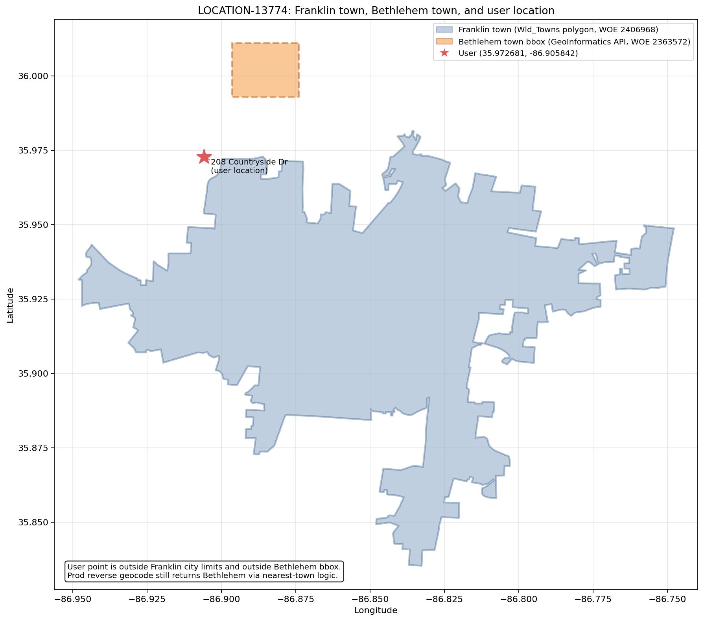

# LOCATION-13774: Town nearby search ranking and performance analysis

This document describes the bug, the ranking approaches we evaluated, the production fix shipped in
[PR #131](https://git.ouryahoo.com/location/geoinformatics_lib_spatial_lookup/pull/131), and the
end-to-end performance benchmark used to compare them.

**Branch:** `fix/location-13774-town-boundary-distance-ranking`

---

## Table of contents

1. [Problem summary](#problem-summary)
   - [Map: user location vs town boundaries](#map-user-location-vs-town-boundaries)
2. [Root cause](#root-cause)
3. [Production fix (chosen approach)](#production-fix-chosen-approach)
4. [Ranking strategies in code](#ranking-strategies-in-code)
5. [Implementation reference](#implementation-reference)
6. [Performance benchmark](#performance-benchmark)
7. [Benchmark results](#benchmark-results)
8. [Correctness validation](#correctness-validation)
9. [Known limitations](#known-limitations)
10. [Re-running the benchmark](#re-running-the-benchmark)

---

## Problem summary

**Ticket:** LOCATION-13774

**User location:** 208 Countryside Dr, Franklin, TN 37069 (`35.972681, -86.905842`)

**Observed behavior:** Reverse geocoder returned **Bethlehem** as the town instead of **Franklin**.

**Expected behavior:** The user sits ~543 m outside the Franklin city polygon boundary but well inside
the 3000 m town search radius. Franklin should win over Bethlehem, a point town ~3745 m away.

### Map: user location vs town boundaries

The map below shows the ticket coordinate (red star), the **Franklin** city-limit polygon from
`Wld_Towns` (WOE 2406968), and the **Bethlehem** bounding box from the GeoInformatics API (WOE
2363572). The user point sits just outside Franklin's northern boundary and outside Bethlehem's bbox,
yet pre-fix centroid ranking returned Bethlehem.



| Layer | Symbol | Source |
|-------|--------|--------|
| User location | Red star | 208 Countryside Dr (`35.972681, -86.905842`) |
| Franklin town | Blue polygon | `Wld_Towns` shapefile (WOE 2406968) |
| Bethlehem town | Orange dashed bbox | GeoInformatics API / `Wld_MBRs` point town (WOE 2363572) |

---

## Root cause

Town lookup in the reverse geocoder uses `SpatialLookup.searchNearby()` with a **single-result** code
path (`fillIndexAndDistance` in `Storage`). Before this fix, when the query point was **outside** a
polygon, ranking used **centroid distance** (`Storage.distance()`), not boundary distance.

At the ticket coordinate:

| Town | Type | Distance used (old) | Value |
|------|------|---------------------|-------|
| Franklin (2406968) | Polygon (`Wld_Towns`) | Centroid | ~6235 m |
| Bethlehem (2363572) | Point town (`Wld_MBRs`) | Point coordinate | ~3745 m |

Bethlehem won because 3745 m < 6235 m, even though the user was only ~543 m from Franklin's city
limit.

The reverse geocoder search radius (`NEARBY_TOWN_RADIUS_METERS = 3000`) and confidence scoring were
not the primary issue; **ranking metric** was.

---

## Production fix (chosen approach)

**Strategy:** `Storage.NearbyRankingStrategy.BOUNDARY` (**opt-in** — not the library default)

**Library default:** `CENTROID` (unchanged) so existing callers are not affected. Services that need
correct town selection near polygon edges (reverse geocoder town layer) should call
`setNearbyRankingStrategy(BOUNDARY)` after building the spatial index.

**Algorithm (hybrid boundary ranking):**

1. If the query point is **inside** the polygon → distance `0` (unchanged).
2. If **outside** → scan boundary vertices with a **cheap relative metric** (squared fixed-point
   deltas, no trigonometry or square root).
3. Track the closest vertex from that scan.
4. Return the **true meter distance** from the query point to that selected vertex via
   `GeometricAlgorithms.distance()` (plane-projected geodesic).

This preserves correct town selection for LOCATION-13774, reports meaningful meter distances in search
results, and avoids calling the expensive distance formula on every boundary vertex.

---

## Ranking strategies in code

The codebase maintains **two** strategies behind `Storage.NearbyRankingStrategy`:

| Strategy | Enum constant | Default? | Exterior-point ranking |
|----------|---------------|----------|------------------------|
| **Library default** | **`CENTROID`** | **Yes** | Centroid distance (`Storage.distance()`) |
| LOCATION-13774 fix | `BOUNDARY` | No (opt-in) | Relative vertex search + meter distance to selected vertex |

`CENTROID` remains the default for backward compatibility. The benchmark compares both strategies;
callers enable `BOUNDARY` explicitly when deploying the town lookup fix.

### Other approaches evaluated (not kept in code)

During investigation we also prototyped full per-vertex meter boundary search and a fused single-pass
ray-cast variant. Those were removed after benchmarking; results are preserved below for reference.

| Approach | Mean latency (aggregate) | Notes |
|----------|---------------------------|-------|
| Full meter boundary | ~2.3 µs | Correct but ~1.6× slower than `BOUNDARY` |
| Fused single-pass | ~3.5 µs | Correct but slowest overall |

**Rejected without implementation:**

- **ROI-adjusted centroid** (`max(0, centroidDist − radiusOfInfluence)`) — weak semantics, bbox-dependent.
- **Pure relative distance in results** — fast but returned squared degree-units instead of meters.

---

## Implementation reference

### Entry point: single-result nearby ranking

`fillIndexAndDistance()` delegates to `rankingDistance()`:

```java
private void fillIndexAndDistance(int[] searchResults, int id, int centerX, int centerY) {
    int newResultId = id;
    int newResultDistance = rankingDistance(id, centerX, centerY);

    if ((searchResults[1] < 0) || (nearer(newResultId, searchResults[1], centerX, centerY,
            newResultDistance, searchResults[0]))) {
        searchResults[0] = newResultDistance;
        searchResults[1] = newResultId;
    }
}
```

File: `src/main/java/com/yahoo/geoinformatics/polygon_lookup/datastore/Storage.java`

### Production path: boundary distance

```java
private int minimumBoundaryDistance(int id, int x, int y) {
    int offset = polygonOffset[id];
    int totalPoints = polygonStore[offset + 5];
    offset += 6;
    int minRelativeDistance = Integer.MAX_VALUE;
    int closestVertexX = 0;
    int closestVertexY = 0;
    for (int i = 1; i < totalPoints; ++i) {
        int x1 = polygonStore[offset++];
        int y1 = polygonStore[offset++];

        int relativeDistance = GeometricAlgorithms.relativeRankingDistance(x, y, x1, y1);
        if (relativeDistance < minRelativeDistance) {
            minRelativeDistance = relativeDistance;
            closestVertexX = x1;
            closestVertexY = y1;
        }
    }
    if (minRelativeDistance == Integer.MAX_VALUE) {
        return Integer.MAX_VALUE;
    }
    return GeometricAlgorithms.distance(x, y, closestVertexX, closestVertexY);
}
```

`rankingDistance()` selects the strategy. Default is `CENTROID`; opt in to `BOUNDARY` via
`setNearbyRankingStrategyForBenchmark(BOUNDARY)` (or the equivalent on `SpatialLookup` / `RTree`):

```java
int rankingDistance(int id, int x, int y) {
    if (checkInsidePolygon(id, x, y)) {
        return 0;
    }
    switch (nearbyRankingStrategy) {
        case BOUNDARY:
            return minimumBoundaryDistance(id, x, y);
        case CENTROID:
        default:
            return distance(id, x, y);
    }
}
```

### Relative metric (vertex selection only)

```java
public static int relativeRankingDistance(int x1, int y1, int x2, int y2) {
    long dx = (long) x1 - x2;
    long dy = (long) y1 - y2;
    long squared = dx * dx + dy * dy;
    if (squared > Integer.MAX_VALUE) {
        return Integer.MAX_VALUE;
    }
    return (int) squared;
}
```

File: `src/main/java/com/yahoo/geoinformatics/polygon_lookup/geometry/GeometricAlgorithms.java`

Coordinates are fixed-point integers scaled by `StorageConstants.ACCURACY_FACTOR` (1_000_000). The
relative metric is monotonic for comparing vertices **within a local search window** but does not
account for longitude compression at higher latitudes.

### True meter distance (final value and baseline comparisons)

```java
public static int distance(int x1, int y1, int x2, int y2) {
    double lat1 = (double) (y1 / StorageConstants.ACCURACY_FACTOR);
    double lon1 = (double) (x1 / StorageConstants.ACCURACY_FACTOR);
    double lat2 = (double) (y2 / StorageConstants.ACCURACY_FACTOR);
    double lon2 = (double) (x2 / StorageConstants.ACCURACY_FACTOR);
    return planeProjectedDistance(lat1, lon1, lat2, lon2);
}
```

`planeProjectedDistance()` uses `Math.toRadians`, `Math.cos`, and `Math.sqrt` — acceptable for a
**single** call per candidate polygon, expensive when called per vertex.

### Opt-in hook

```java
lookup.setNearbyRankingStrategyForBenchmark(Storage.NearbyRankingStrategy.BOUNDARY);
```

Exposed through `SpatialLookup` and `RTree`. If unset, `CENTROID` applies. The benchmark sets the
strategy per run; reverse geocoder should set `BOUNDARY` once after index load for town lookup.

---

## Performance benchmark

### Harness

**Class:** `TownLayerNearbySearchPerfBenchmark`

**Path:** `src/test/java/com/yahoo/geoinformatics/polygon_lookup/spatial/TownLayerNearbySearchPerfBenchmark.java`

The benchmark measures **end-to-end** `SpatialLookup.searchNearby()` latency on the production town
datapack, including R-tree traversal, ranking, and confidence scoring — not micro-benchmarks of
individual distance calls.

### Datapack

| Property | Value |
|----------|-------|
| S3 source | `s3://yp--userlocation-prd-use1--geo-datapacks/reverse_geocoder_datapacks/1.10.12/world_town.dp` |
| Size | ~528 MB |
| Local path (gitignored) | `src/test/resources/perf/world_town/world_town.dp` |

Copy locally before running:

```bash
mkdir -p src/test/resources/perf/world_town
aws s3 cp s3://yp--userlocation-prd-use1--geo-datapacks/reverse_geocoder_datapacks/1.10.12/world_town.dp \
  src/test/resources/perf/world_town/world_town.dp
```

### Parameters (match reverse geocoder town lookup)

```java
private static final int TOWN_RADIUS_METERS = 3000;
private static final int HORIZONTAL_ACCURACY = 0;
private static final int WARMUP_ITERATIONS = 500;
private static final int MEASURE_ITERATIONS = 5000;
```

### Query suites (124 points total)

1. **Regression anchor** — `location_13774_franklin_ticket` (35.972681, -86.905842)
2. **Franklin centroid** — (35.92425, -86.87093)
3. **Global cities** — NYC, LA, Chicago, London, Paris, Tokyo, Sydney, São Paulo, Mumbai
4. **Sparse / edge latitudes** — rural Montana, Fairbanks, Honolulu
5. **Franklin 2 km ring** — 8 bearings (0°, 45°, … 315°) around the ticket point
6. **US grid** — 10×10 lattice from (25°N, 125°W) stepping 3° lat / 6° lon

Built in `buildQuerySuites()`:

```java
queries.add(new QueryPoint("location_13774_franklin_ticket", 35.972681, -86.905842));
// ... global cities ...
for (int bearing = 0; bearing < 360; bearing += 45) {
    double radians = Math.toRadians(bearing);
    double lat = 35.972681 + (2.0 / 111.0) * Math.cos(radians);
    double lon = -86.905842 + (2.0 / (111.0 * Math.cos(Math.toRadians(35.972681)))) * Math.sin(radians);
    queries.add(new QueryPoint(String.format(Locale.US, "franklin_ring_2km_%03d", bearing), lat, lon));
}
for (int latStep = 0; latStep < 10; ++latStep) {
    for (int lonStep = 0; lonStep < 10; ++lonStep) {
        double lat = 25.0 + latStep * 3.0;
        double lon = -125.0 + lonStep * 6.0;
        queries.add(new QueryPoint(String.format(Locale.US, "us_grid_%02d_%02d", latStep, lonStep), lat, lon));
    }
}
```

### Measurement methodology

For each `(strategy, query point)` pair:

1. Set strategy via `lookup.setNearbyRankingStrategyForBenchmark(strategy)`.
2. **Warm up** — 500 iterations (JIT, caches).
3. **Measure** — 5000 iterations; record `System.nanoTime()` per call.
4. Aggregate mean, p50, p95, p99, min, max, and derived QPS.
5. Append results to `target/town-layer-perf-report.md`.

Timing loop:

```java
for (int i = 0; i < iterations; ++i) {
    long start = System.nanoTime();
    lookup.searchNearby(query.lat, query.lon, HORIZONTAL_ACCURACY, TOWN_RADIUS_METERS, results, null);
    samples.add(System.nanoTime() - start);
}
```

### Strategies compared (maintained in code)

```java
@DataProvider(name = "strategies")
public Object[][] strategies() {
    return new Object[][] {
        {Storage.NearbyRankingStrategy.CENTROID, "baseline_centroid"},
        {Storage.NearbyRankingStrategy.BOUNDARY, "production_boundary"}
    };
}
```

---

## Benchmark results

Environment: local Maven test run on `world_town.dp` v1.10.12. Absolute numbers vary by machine; **relative**
ordering between strategies is stable.

### Aggregate (all 124 query points × 5000 iterations)

| Strategy | Mean | p50 | p95 | p99 | Throughput | In code? |
|----------|------|-----|-----|-----|------------|----------|
| Baseline centroid | 1.3 µs | 0.8 µs | 3.5 µs | 7.2 µs | ~780k qps | Yes (`CENTROID`) |
| **Production boundary** | **1.4 µs** | **0.8 µs** | **4.6 µs** | **7.1 µs** | **~713k qps** | **Yes (`BOUNDARY`)** |
| Full meter boundary | 2.3 µs | 0.8 µs | 11.9 µs | 15.3 µs | ~434k qps | Removed |
| Fused boundary | 3.5 µs | 0.8 µs | 14.5 µs | 27.0 µs | ~287k qps | Removed |

**Takeaways:**

- `BOUNDARY` adds ~8% mean latency vs baseline centroid (acceptable for correctness).
- `BOUNDARY` is ~1.6× faster than the removed full per-vertex meter search.
- Fused single-pass was slower than separate PiP + boundary — not kept.

### LOCATION-13774 ticket point

| Strategy | Mean latency | Ranked town | Distance in results | In code? |
|----------|-------------|-------------|---------------------|----------|
| Centroid | 2.8 µs | Bethlehem (wrong) | 3745 m | Yes |
| **Boundary** | **4.5 µs** | **Franklin** | **545 m** | **Yes** |
| Full meter boundary | 12.1 µs | Franklin | 542 m | Removed |
| Fused | 10.6 µs | Franklin | ~542 m | Removed |

The 545 m vs 542 m difference on the hybrid path occurs because the relative metric may select a
**nearby but different boundary vertex** than full per-vertex meter search. The reported value is
still the **true meter distance to the selected vertex**.

Full per-query tables are written to `target/town-layer-perf-report.md` after each benchmark run.

---

## Correctness validation

The benchmark includes a TestNG regression check (run only with `-DrunTownPerfBenchmark=true`):

### Franklin ticket regression

```java
@Test
public void verifyFranklinTicketCorrectnessAcrossStrategies() {
    QueryPoint franklinTicket = new QueryPoint("location_13774", 35.972681, -86.905842);

    SampleResult centroid = runOnce(Storage.NearbyRankingStrategy.CENTROID, franklinTicket);
    SampleResult boundary = runOnce(Storage.NearbyRankingStrategy.BOUNDARY, franklinTicket);

    Assert.assertEquals(centroid.distanceMeters, 3745, ...);
    Assert.assertTrue(boundary.distanceMeters < 1000, ...);
    Assert.assertNotEquals(centroid.attributeIndex, boundary.attributeIndex, ...);
}
```

Unit test for relative metric ordering:

`src/test/java/com/yahoo/geoinformatics/polygon_lookup/geometry/GeometricAlgorithmsTest.java`
→ `testRelativeRankingDistancePreservesOrder()`

---

## Known limitations

1. **Vertex sampling, not true point-to-segment distance.** `minimumBoundaryDistance()` iterates polygon
   **vertices**. For Franklin the vertex estimate (~545 m) matches the true boundary distance (~543 m)
   closely enough; sliver edges could differ more.

2. **Relative vertex selection.** At mid-latitudes the squared-degree metric may select a nearby vertex
   that differs slightly from a full per-vertex meter scan (545 m vs 542 m at LOCATION-13774). The
   reported value is still the true meter distance to the selected vertex.

3. **Scope of ranking change.** `fillIndexAndDistance()` is used for all **single-result** `searchNearby`
   callers (town, postal, airport, suburb, tribal layers), not town alone.

4. **Confidence scoring unchanged.** `calculateConfidenceScore()` still uses bbox centroids and full
   geometric overlap math; only the **ranking distance** path changed.

---

## Re-running the benchmark

```bash
# 1. Ensure datapack is present (see Datapack section above)

# 2. Run benchmark + correctness checks
mvn -Dtest=TownLayerNearbySearchPerfBenchmark -DrunTownPerfBenchmark=true test

# 3. View report
cat target/town-layer-perf-report.md
```

Regular CI tests **exclude** the benchmark unless the system property is set (528 MB datapack load +
~620k timed iterations).

Run the standard test suite without the perf flag:

```bash
mvn test
```

---

## Related files

| File | Role |
|------|------|
| `Storage.java` | Ranking strategies, `minimumBoundaryDistance`, `fillIndexAndDistance` |
| `GeometricAlgorithms.java` | `relativeRankingDistance`, `distance`, `planeProjectedDistance` |
| `SpatialLookup.java` / `RTree.java` | Benchmark strategy hooks |
| `TownLayerNearbySearchPerfBenchmark.java` | Benchmark harness and correctness tests |
| `GeometricAlgorithmsTest.java` | Unit test for relative metric ordering |
| `.gitignore` | Ignores `src/test/resources/perf/world_town/world_town.dp` |
| `doc/images/location_13774_towns_map.png` | Map of user location, Franklin polygon, and Bethlehem bbox |
