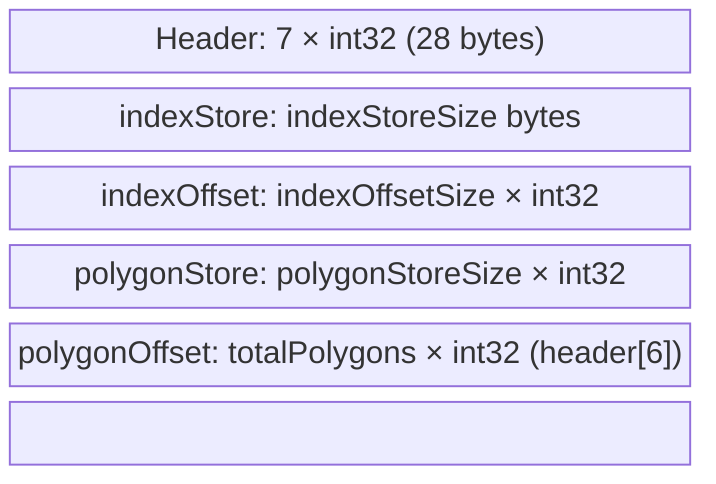

# Spatial `.dp` file format (R-Tree datapack)

This document describes what is **inside a `.dp` file** produced or consumed by **SPATIARI** (`com.yahoo.spatiari:spatiari`; Java package `com.yahoo.geoinformatics.polygon_lookup`). The implementation lives mainly in `datastore/Storage.java`, `rtree/RTree.java`, and `spatial/SpatialIndexer.java`.

> **Scope:** This is the **polygon R-Tree** on-disk format used for `SpatialIndexer.buildIndexFromShapes` / `buildIndexFromTextFiles` → `RTree.storeIndex` and `Storage.loadFrom`.  
> **Other** projects may also use the extension `.dp` for **unrelated** payloads (for example a single Java-serialized `int[]` for WOE cache in the reverse geocoder). Those files are **not** described here.

---

## 1. What problem does this file solve?

The library stores:

1. An **R-Tree** over polygon **minimum bounding rectangles (MBRs)** for fast spatial filtering.
2. The **full polygon geometry** (outer ring, optional inner rings) and per-feature **metadata** (attribute index, area, centroid, radius of influence) in a flat integer store.

At runtime, `Storage.loadFrom` → `RTree` → `SpatialLookup` supports point-in-polygon, radius search, and related queries without re-reading shapefiles.

---

## 2. Two on-disk encodings (same logical data)

`RTree.storeIndex(String path, boolean storageNeutral)` chooses the writer:

| `storageNeutral` | Writer | Typical use |
|------------------|--------|-------------|
| **`true`** | `Storage.saveDatapack` | **Language-neutral** binary: fixed header + raw bytes/ints. No Java `ObjectOutputStream` in the payload. |
| **`false`** | `Storage.save` | **Java serialization**: five `writeObject` calls in a fixed order (see below). |

`Storage.loadFrom(path, storageNeutral)` must use the **same** flag that was used when the file was written.

Downstream, **reverse geocoder** often sets `Constants.LANGUAGE_NEUTRAL_SUPPORT = false` and therefore uses the **Java-serialized** form for many admin polygon packs; other pipelines may opt into the language-neutral form (see release notes in `README.md`).

---

## 3. Logical in-memory layout (`Storage`)

Conceptually a loaded datapack contains:

| Region | Java type (in memory) | Purpose |
|--------|------------------------|--------|
| **headerStore** | `int[]` (length `StorageConstants.MAX_HEADER_SIZE`, i.e. **7**) | R-Tree root id, height, max children, and (for language-neutral I/O) sizes of the bulk regions. |
| **indexStore** | `byte[]` | Serialized R-Tree **nodes**: each node has an MBR (4 × int32) + 1 byte child count + up to N child node ids (int32 each). |
| **indexOffset** | `int[]` | Byte offset in `indexStore` for each R-Tree node id. |
| **polygonStore** | `int[]` | Packed polygon records (metadata + coordinates as fixed-point ints). |
| **polygonOffset** | `int[]` | Start index in `polygonStore` for each **leaf / polygon id** (0 .. totalPolygons−1). |

Integers in `indexStore` use **big-endian** layout (`ByteArray.readInt` / `writeInt`).

---

## 4. Language-neutral file layout (byte order on disk)

Written by `Storage.saveDatapack` and read by `Storage.loadFromLanguageAgnostic`.

### Header (`headerStore[0..6]`, each `int32` big-endian via `DataOutputStream.writeInt`)

| Index | Field | Meaning |
|------|--------|--------|
| 0 | root | R-Tree root node id |
| 1 | height | Tree height / depth |
| 2 | maxChildren | Max fan-out of an internal node (e.g. 7 for normal builds, 25 for ZIP+4) |
| 3 | indexStoreSize | Byte length of `indexStore` |
| 4 | indexOffsetSize | Length of `indexOffset` array |
| 5 | polygonStoreSize | Length of `polygonStore` int array |
| 6 | totalPolygons | Number of polygon records (= length of `polygonOffset`) |

After reading the header, the reader allocates arrays and reads **index bytes**, then **index offsets**, then **polygon ints**, then **polygon offsets** — see `loadFromLanguageAgnostic`.

---

## 5. Java-serialized file layout (`storageNeutral == false`)

`Storage.save` uses `ObjectOutputStream` and writes **in this order**:

1. `int[]` headerStore  
2. `byte[]` indexStore  
3. `int[]` indexOffset  
4. `int[]` polygonStore  
5. `int[]` polygonOffset  

`Storage.loadFrom` with `storageNeutral == false` reads the same five objects back via a **class-allowlist** `ObjectInputStream` that accepts only `[I` (`int[]`) and `[B` (`byte[]`). The **logical** content is identical to the language-neutral layout; only the **envelope** (Java serialization) differs. Prefer `storageNeutral == true` for new datapacks.

---

## 6. R-Tree node in `indexStore` (per node)

Layout at `indexOffset[id]`:

1. **MBR** — 4 big-endian int32: `maxX`, `maxY`, `minX`, `minY` (see `storeIndex` / `getNode`).  
2. **Child count** — 1 byte: `0` means **leaf** (polygon entry); `> 0` means internal node, followed by that many int32 child **node ids**.  
3. **Children** — `childCount` × int32 node ids (only if internal).

Leaf nodes link to **polygon entry indices** by the R-Tree construction; the leaf’s geometry and attribute index live in `polygonStore`.

---

## 7. One polygon record in `polygonStore`

Starting at `polygonOffset[id]`, `storePolygon` writes (all **`int`**, fixed-point for coordinates where noted):

| Order | Content |
|------|---------|
| 1 | **attribute index** (running index for attribute sidecar; maps to your id column after lookup) |
| 2 | area |
| 3 | centroid X (scaled, see `ACCURACY_FACTOR`) |
| 4 | centroid Y (scaled) |
| 5 | radius of influence |
| 6 | number of **outer** boundary points (N) |
| 7+ | 2N ints: outer ring vertices (x,y pairs) |
| next | **ring count** (inner rings) |
| per ring | MBR 4 ints, ring point count, then 2× count vertex ints |

`StorageConstants.ACCURACY_FACTOR` (1e6) scales lat/lon as integers. `POLYGON_METADATA_SIZE` is **7** leading metadata ints before the outer boundary count (see `StorageConstants` and `storePolygon`).

---

## 8. Which API produces this file?

| Entry | Produces |
|--------|----------|
| `SpatialIndexer.buildIndexFromShapes` | Shapefile (+ optional points/radius) → R-Tree → `.dp` |
| `SpatialIndexer.buildIndexFromTextFiles` | Text files (e.g. ZIP+4 pipeline) → R-Tree → `.dp` |
| `SpatialIndexer.buildIndexFromDatapack` | **Reads** an existing `.dp` and returns `SpatialLookup` (does not define a new format) |

Max children: **7** for standard polygon index, **25** for text-file / ZIP+4 build (`SpatialIndexer`).

---

## 9. Related constants

- `StorageConstants`: sizes, `MAX_HEADER_SIZE`, `POLYGON_METADATA_SIZE`, `ACCURACY_FACTOR`, etc.  
- `Storage.save` / `saveDatapack` / `loadFrom` / `loadFromLanguageAgnostic`: exact I/O.  
- `RTree.storeIndex`: selects save path from `storageNeutral`.

For **consuming** these files from Java, use the public API `SpatialIndexer.buildIndexFromDatapack(path, storageNeutral)` with the same `storageNeutral` value used at build time.
